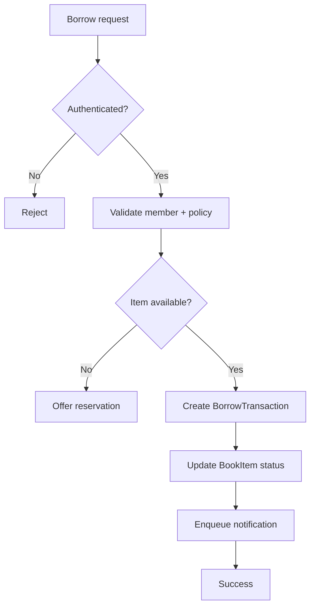
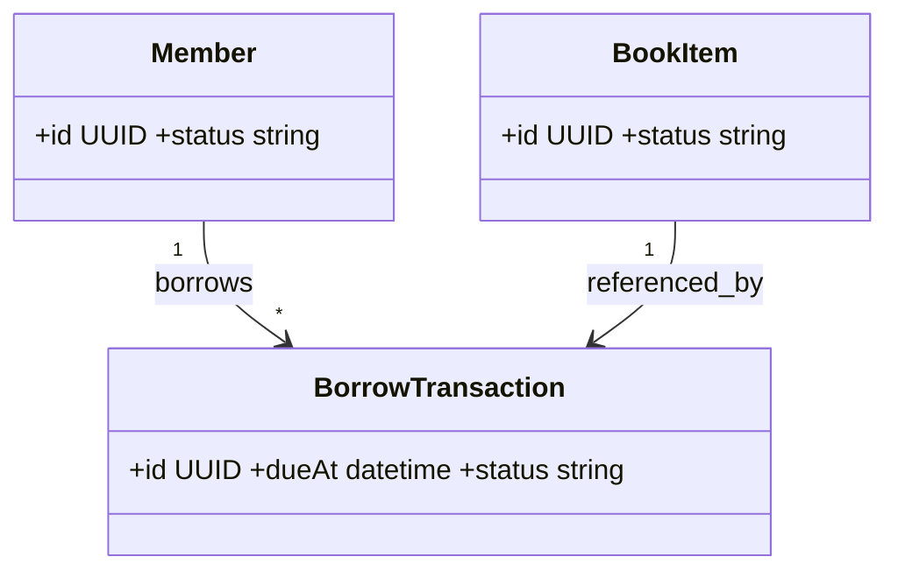
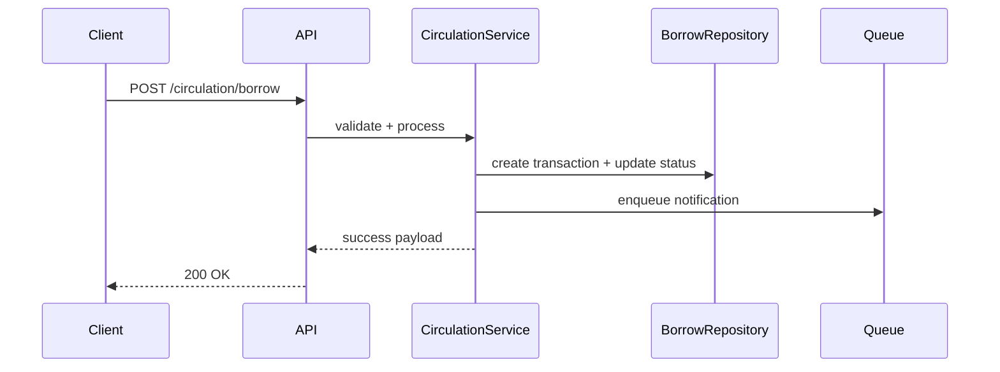

# Approved Example — Backend (Condensed End-to-End)

## A. Context & Scope
- In-scope: Auth, Catalog Search, Borrow/Return, Reservation, Fine, Notifications.
- Out-of-scope: Frontend UX details, external BI pipelines.
- Actors: Member, Librarian, Admin, Worker.

## B. Use Case (sample UC-004 Borrow)
- Preconditions: actor authenticated; member active; item exists.
- Main flow: request borrow -> validate member/policy -> create borrow transaction -> update item status -> enqueue notification -> success.
- Exception flow: item unavailable -> reserve suggestion.
- Postconditions: transaction active; item borrowed.

## C. Activity (sample)

## D. Domain model (sample)

## E. Sequence (sample)

## F. Traceability sample
| Use Case | Endpoint | Service | Repository | Model | Test |
|---|---|---|---|---|---|
| UC-004 Borrow | POST /circulation/borrow | CirculationService.borrow | BorrowRepository.create | BorrowTransaction, BookItem | tests/integration/test_circulation_api.py::test_borrow_success |

## G. Quality/Gap snapshot
- Strength: consistent layering and flow.
- Gap: missing explicit idempotency contract for retry of async notification.
