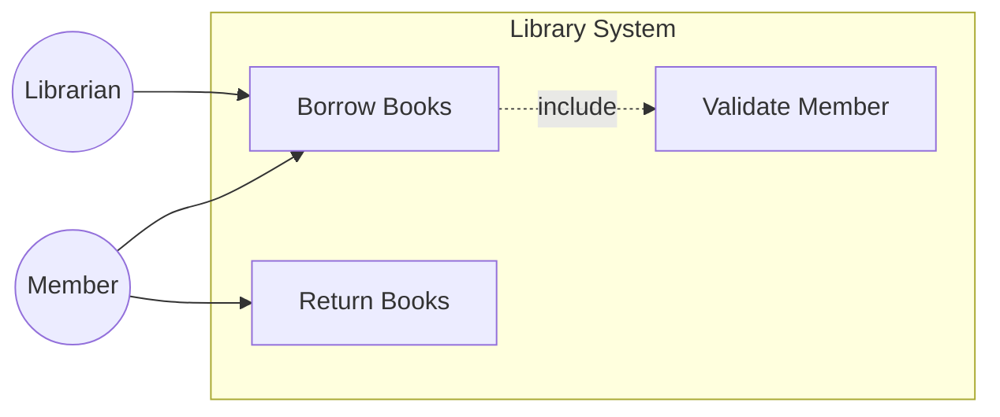
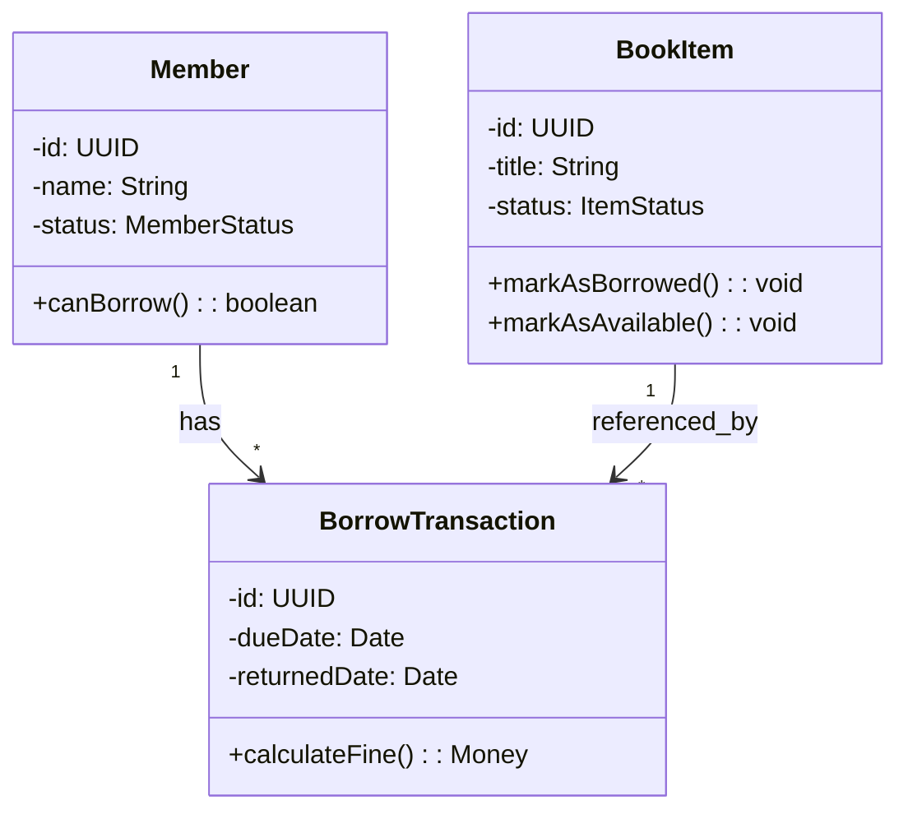
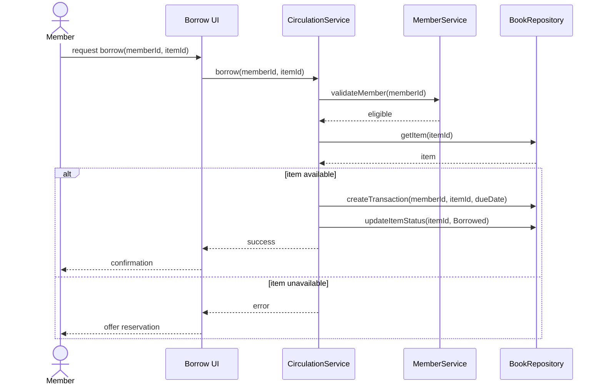
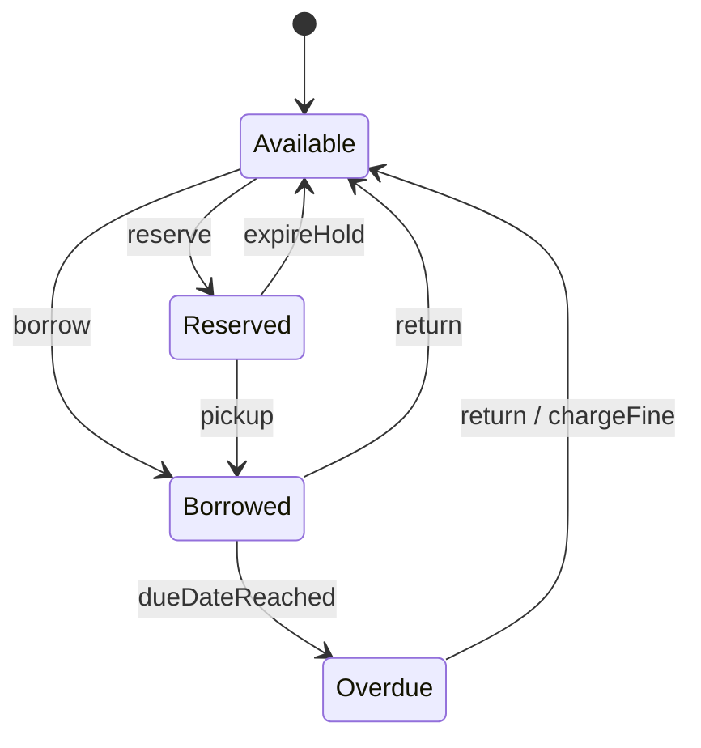
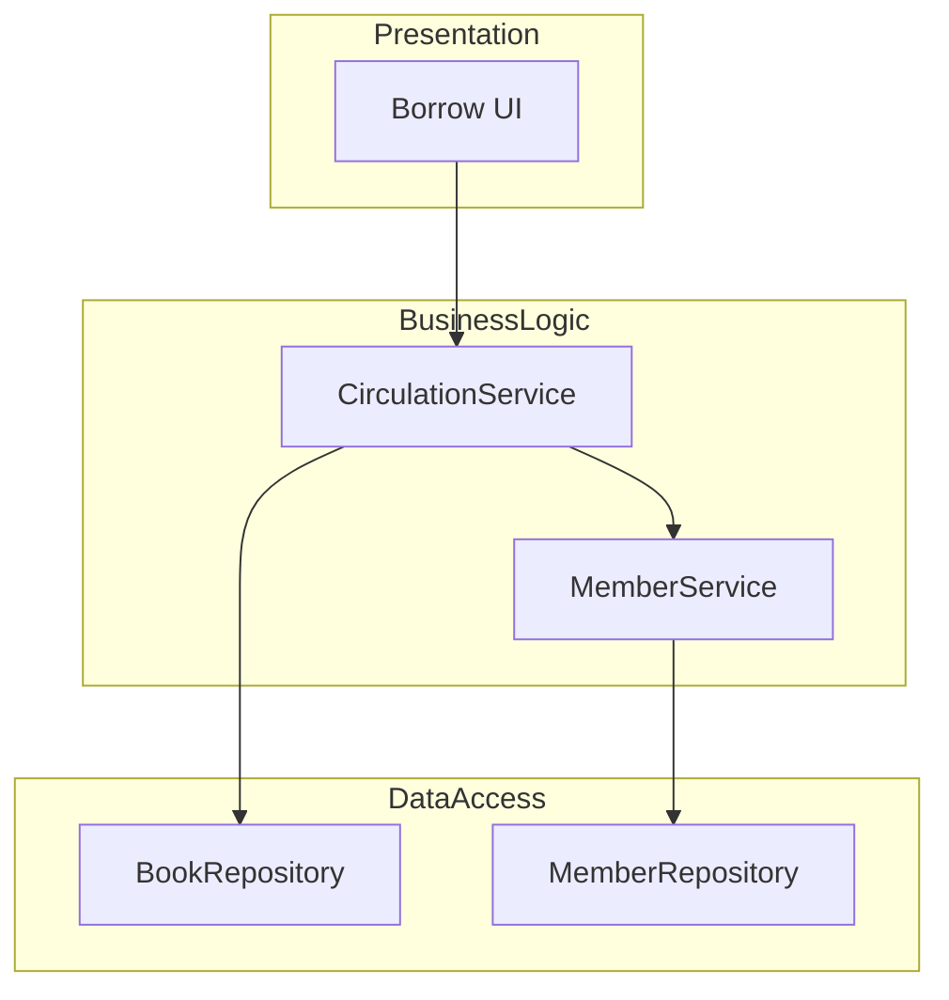

# Example — End-to-End Mini Walkthrough (Library System)

> **Lưu ý**: ví dụ này chỉ minh họa cách áp dụng skill cho 1 use case duy nhất, không phải full system. Ví dụ dùng domain "library" theo cuốn Dennis et al., có thể adapt cho domain khác (e-commerce, hospital, banking…).

---

## Phase 1 — Functional

### Use Case Diagram (rút gọn)

### Use Case Description (UC-001: Borrow Books)

| Field | Value |
|---|---|
| Name | Borrow Books |
| ID | UC-001 |
| Type | Detail · Essential |
| Importance | High |
| Primary Actor | Member |
| Brief Description | Member borrows a book item from the library. |
| Trigger | Member submits a borrow request. |
| Trigger type | External |

**Stakeholders**:
- Member — wants to borrow item successfully.
- Librarian — wants to ensure policies are enforced.
- Library — wants accurate inventory and traceable transactions.

**Relationships**:
- Association: Member, Librarian
- Include: UC-004 Validate Member

**Normal Flow**:
1. The Member submits a borrow request with their ID and the desired book item.
2. The System validates the Member's status (executes UC-004).
3. The System checks the availability of the book item.
4. The System creates a borrow transaction with a due date.
5. The System updates the book item status to Borrowed.
6. The System notifies the Member of the successful borrow.

**Alternate Flow A-1** (after step 3): If the item is unavailable, the System offers a reservation option.

**Exception Flow E-1** (after step 2): If the Member is not eligible to borrow, the request is rejected.

**Preconditions**: Member is authenticated; Book item exists in the catalog.
**Postconditions**: Borrow transaction is active; Book item is borrowed.

---

## Phase 2 — Structural

### CRC Card — BookItem (rút gọn)

**Front**:
- **Class**: BookItem · **ID**: CRC-02 · **Type**: Concrete, Domain
- **Description**: A physical copy of a title in the library.
- **Use Cases**: UC-001, UC-002, UC-003

| Responsibilities | Collaborators |
|---|---|
| Knows its ID, title, status | — |
| Marks itself as Borrowed | BorrowTransaction |
| Marks itself as Available | — |
| Knows whether it can be borrowed | — |

**Back**:
- Attributes: id (UUID), title (String), status (ItemStatus enum), location (String)
- Generalization: —
- Aggregation: —
- Other: BorrowTransaction (1 : 0..*)

### Class Diagram (rút gọn)

---

## Phase 3 — Behavioral

### Sequence Diagram (UC-001 main flow)

### State Machine — BookItem

---

## Phase 4 — Design (snapshot)

### Package Diagram

### Traceability (1 row sample)

| UC ID | UC | Class | Operation | Sequence | State | Component | Test | Coverage |
|---|---|---|---|---|---|---|---|---|
| UC-001 | Borrow Books | BookItem, BorrowTransaction, Member | markAsBorrowed, calculateFine, canBorrow | SD-001 | SM-BookItem | circulation-service | tests/test_borrow.py::test_borrow_success | Y |

---

## V&V — Balancing Check (rút gọn)

| Quy tắc | Status | Notes |
|---|---|---|
| 1. Class ↔ UC | ✓ | BookItem, Member, BorrowTransaction đều có UC liên quan. |
| 2. Step ↔ Operation | ✓ | Mỗi bước có operation tương ứng. |
| 8. Operation ↔ Message | ✓ | Mọi message gọi operation tồn tại. |
| 9. State ↔ Attribute | ✓ | State BookItem khớp với `status` attribute. |
| 10. Lifecycle → State Machine | ✓ | BookItem có lifecycle phức tạp → có state machine. |

---

## Cách dùng ví dụ này

Khi áp dụng skill cho project mới:
1. Thay `Member`, `BookItem`, `BorrowTransaction` bằng class của domain bạn.
2. Thay `Borrow`, `Return` bằng UC nghiệp vụ bạn.
3. Giữ nguyên cấu trúc artifact + balancing check.
4. Adapt template trong `templates/` cho từng artifact của project.
