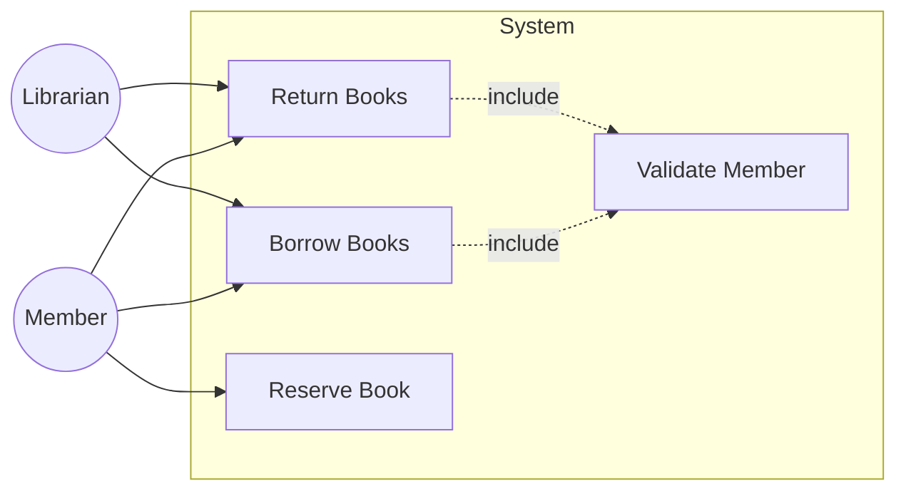
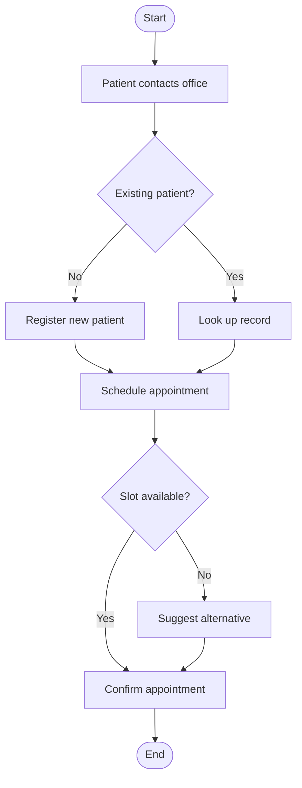
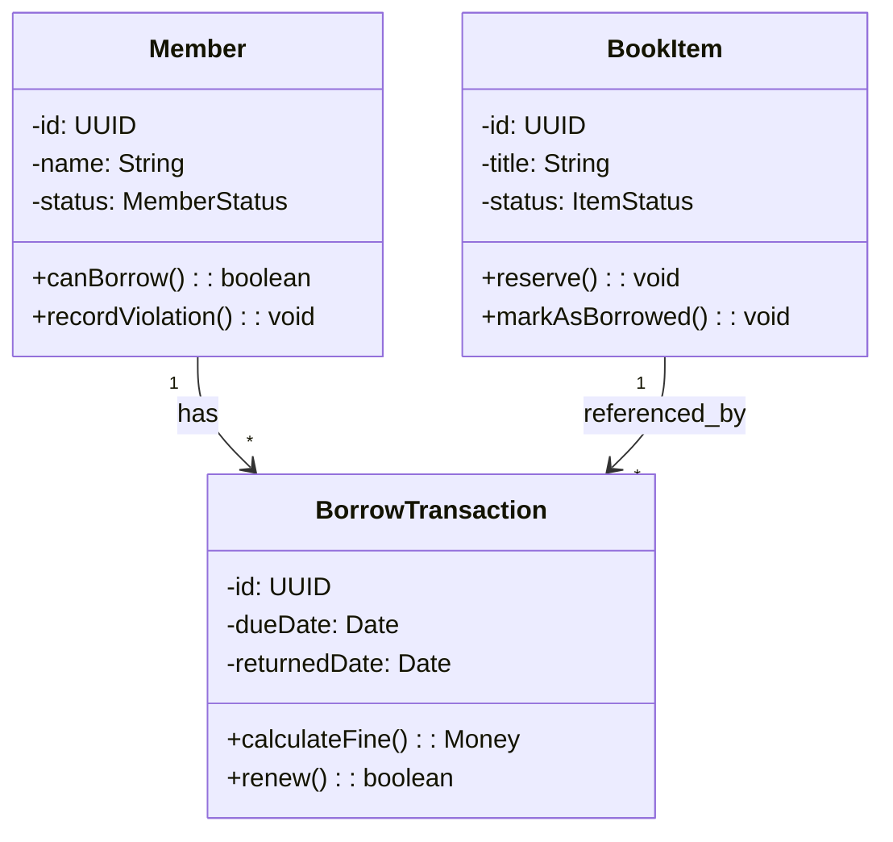
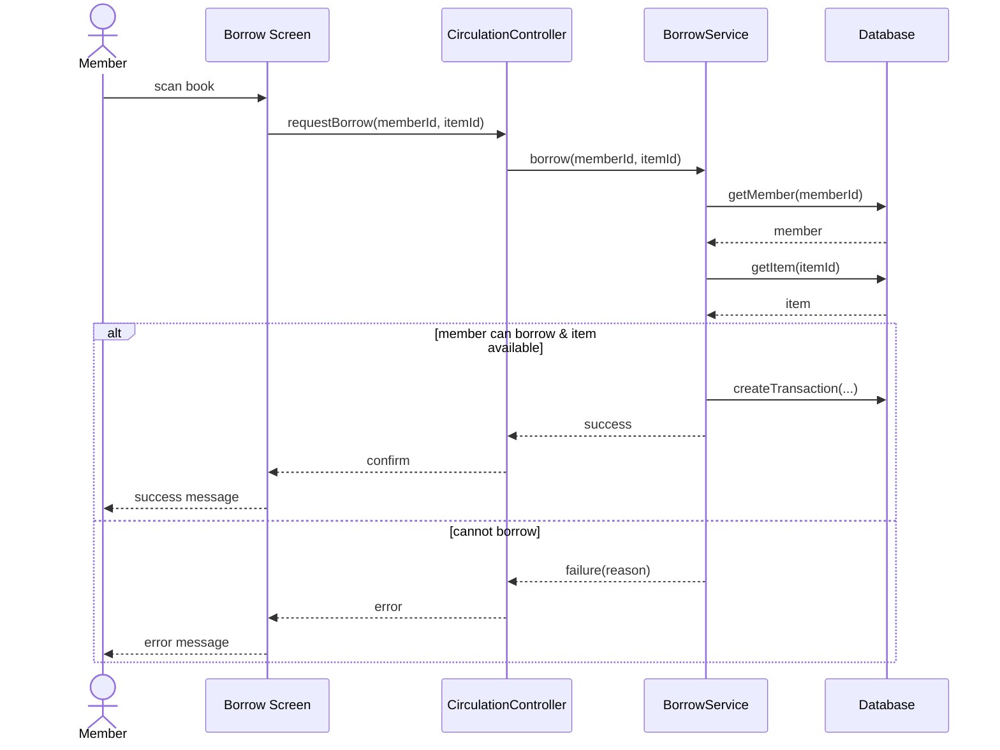
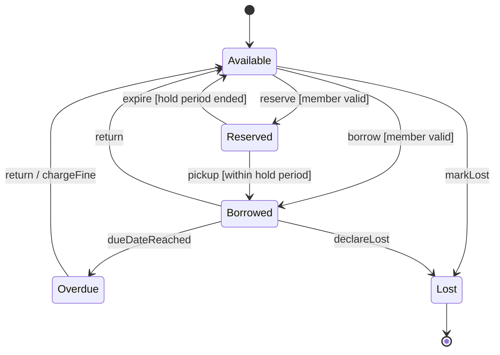
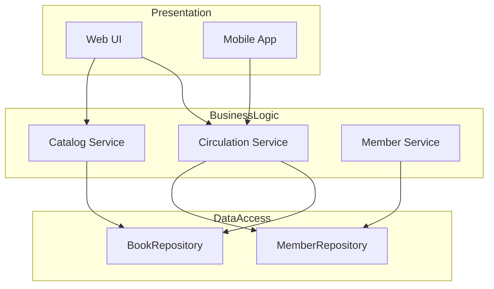
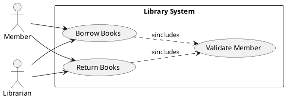
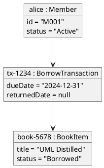

# UML Notation — Mermaid & PlantUML Reference

## 1. Triết lý
- **Default**: Mermaid (render được trực tiếp trong Markdown, GitHub, hầu hết viewer).
- **Fallback**: PlantUML khi Mermaid không hỗ trợ (use case diagram chuẩn UML, communication diagram, object diagram).

## 2. Bảng tra cứu nhanh

| UML Diagram | Mermaid syntax | PlantUML syntax | Ghi chú |
|---|---|---|---|
| Use Case | `flowchart` (workaround) | `@startuml ... @enduml` với `actor`, `usecase`, `:UC1:` | Mermaid không có UC chuẩn; PlantUML là chuẩn |
| Activity | `flowchart TD` | `@startuml ... :Action;` | Mermaid OK cơ bản; thiếu swimlane |
| Class | `classDiagram` | `@startuml ... class A {} @enduml` | Cả hai đều tốt |
| Object | (không có chuẩn) | `@startuml ... object obj1 ... @enduml` | Dùng PlantUML |
| Sequence | `sequenceDiagram` | `@startuml ... A->B: msg @enduml` | Cả hai đều rất tốt |
| Communication | (không có chuẩn) | `@startuml ... A "1: msg" --> B @enduml` | Dùng PlantUML hoặc bảng |
| State | `stateDiagram-v2` | `@startuml ... [*] --> A @enduml` | Cả hai đều tốt |
| Package | `flowchart` với `subgraph` | `@startuml package "P1" {} @enduml` | PlantUML chuẩn hơn |
| Component | `flowchart` với `subgraph` | `@startuml component A @enduml` | PlantUML chuẩn hơn |
| Deployment | `flowchart` với `subgraph` | `@startuml node "Server" {} @enduml` | PlantUML chuẩn hơn |

## 3. Quy ước đặt tên (áp dụng mọi diagram)
- **Actor / Role**: PascalCase hoặc nhãn tự nhiên (Member, Librarian, AdminUser).
- **Use case / Action**: động từ + bổ ngữ (Borrow Books, Submit Order).
- **Class / Entity**: PascalCase, danh từ số ít (Patient, BookItem, BorrowTransaction).
- **Attribute**: camelCase (firstName, dueDate, totalAmount).
- **Operation/Method**: camelCase, bắt đầu bằng động từ (calculateFine(), validateMember()).
- **State**: danh từ trạng thái (Available, Reserved, Overdue) — KHÔNG phải động từ ("Borrowing" sai, "Borrowed" đúng).
- **Event** (transition trigger): động từ hoặc danh từ sự kiện (borrowRequested, paymentReceived).
- **Package**: PascalCase hoặc lowercase với dấu chấm (CatalogManagement hoặc catalog.management).
- **Component**: PascalCase với stereotype ≪component≫.
- **Glossary nhất quán**: nếu đã chọn "Member" thì xuyên suốt là "Member", không khi nào "User" khi khác "Customer".

## 4. Mermaid examples chuẩn

### 4.1 Use Case Diagram (workaround với flowchart)


### 4.2 Activity Diagram


### 4.3 Class Diagram


### 4.4 Sequence Diagram


### 4.5 State Machine


### 4.6 Package / Component (workaround flowchart)


## 5. PlantUML examples (khi cần UML đúng nghĩa)

### 5.1 Use Case Diagram


### 5.2 Object Diagram


### 5.3 Communication Diagram
```plantuml
@startuml
object Member as M
object UI as U
object Controller as C
object Service as S

M -> U : 1: clickBorrow()
U -> C : 2: borrow(memberId, itemId)
C -> S : 3: validateAndProcess()
S -> S : 3.1: checkMember()
S -> S : 3.2: checkItem()
S -> S : 3.3: createTx()
@enduml
```

## 6. Anti-patterns ký pháp
1. **Diagram đa mục đích**: 1 sơ đồ kể nhiều câu chuyện (cấu trúc + hành vi + triển khai). Mỗi diagram chỉ 1 mục đích.
2. **Trộn analysis & design** trong 1 diagram (vd: domain class + Repository + Controller cùng lúc).
3. **Tên kỹ thuật cho UC nghiệp vụ** ("Save User to DB" thay vì "Register Member").
4. **Multiplicity lười** (`*` mọi nơi).
5. **State name là động từ** ("Borrowing" thay vì "Borrowed").
6. **Sequence không khớp class** (gọi method không có trong class diagram).
7. **Activity không có start/end** rõ.
8. **Use case description có "click button" trong essential flow** (đó là real flow).
9. **Không có exception flow** ở use case quan trọng.
10. **Glossary trượt giữa diagram** (chỗ "Member", chỗ "User", chỗ "Customer" cho cùng khái niệm).
